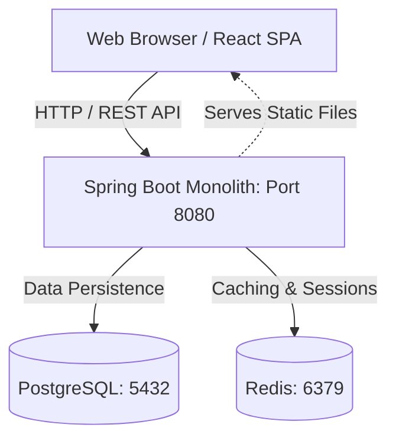
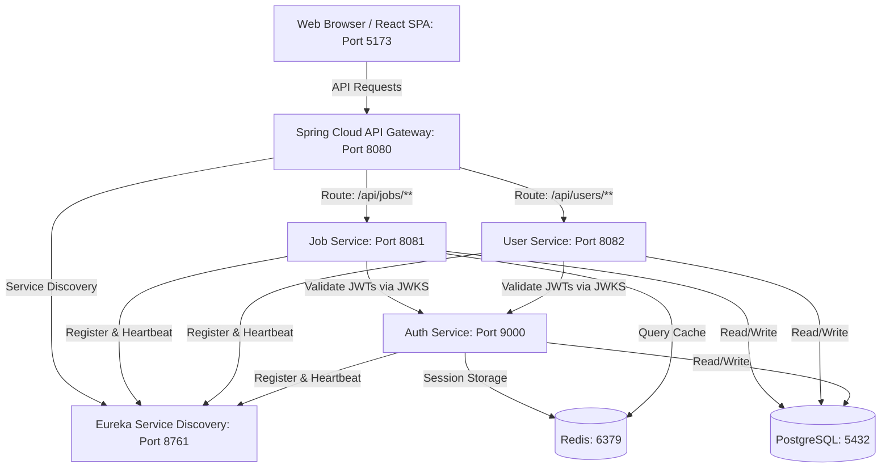

# 🎯 SkillHub Job Board

SkillHub is a modern, high-performance, full-stack Job Board application built to showcase modern software architecture. The codebase is designed with a **dual-architecture model**, allowing it to run as a **Unified Single Web App (Monolith)** for simple, cost-effective deployments, or as a **Distributed Microservices Mesh** for enterprise scalability.

---

## 🏗️ System Architectures

SkillHub can be configured and run in one of two modes:

### 1. Unified Single Web App (Monolith - Production Default)
In this mode, the Vite React SPA is compiled and embedded directly as static assets inside the Spring Boot backend service. The application runs as a single jar, connecting to PostgreSQL and Redis. This is the setup used for cloud deployments (e.g., Render.com).



### 2. Distributed Microservices Mesh (Enterprise Dev Mode)
For microservices development, the application is divided into independent Spring Boot applications coordinated via Spring Cloud components.



---

## 🛠️ Technology Stack

### Frontend
- **Framework:** React 19 (via Vite)
- **Styling:** Tailwind CSS v3 & Lucide React (icons)
- **State & Data Fetching:** TanStack React Query v5 & Axios
- **Routing:** React Router DOM v7
- **Linter:** Oxlint (high-performance JS/TS linter)

### Backend Services & Microservices
- **Core Framework:** Spring Boot 3.x / Java 21
- **Security:** Spring Security & Spring Boot OAuth2 Resource Server
- **Data Layer:** Spring Data JPA & Hibernate
- **Database:** PostgreSQL 16
- **Caching & Session Management:** Redis 7 / Spring Data Redis
- **Microservice Routing:** Spring Cloud Gateway
- **Service Registry:** Spring Cloud Eureka Server
- **Resilience:** Resilience4j Circuit Breaker (configured in API Gateway)
- **Rate Limiting:** Redis-backed Request Rate Limiter (configured in API Gateway)

---

## 📂 Project Structure

```bash
SkillHub/
├── .dockerignore
├── Dockerfile                  # Multi-stage Dockerfile for Monolith production builds
├── docker-compose.yml          # Local infra services (Postgres + Redis + App container)
├── render.yaml                 # Infrastructure-as-code configuration for Render.com
│
├── frontend/                   # React Vite Single Page Application (SPA)
│   ├── src/                    # Components, hooks, router, and page views
│   ├── public/                 # Static asset public folder
│   ├── package.json            # Frontend dependency and script declarations
│   └── vite.config.js          # Vite and React development server settings
│
├── backend/                    # Monolith Spring Boot Backend
│   ├── src/main/java/com/skillhub/  # Source code (Controllers, Services, Models, Repositories)
│   └── src/main/resources/     # Configuration (application.yml, templates, schemas)
│
# Spring Cloud Microservices:
├── eureka-server/              # Service Registry (Port 8761)
├── api-gateway/                # Edge Routing, Circuit Breaker, Rate Limiter (Port 8080)
├── auth-service/               # OAuth2 Authorization & Token Server (Port 9000)
├── user-service/               # Handles profiles and credentials (Port 8082)
└── job-service/                # Handles job listings and applications (Port 8081)
```

---

## 🚀 Running Locally

### 1. Prerequisites
Before getting started, make sure you have installed:
- [Java 21 JDK](https://adoptium.net/temurin/releases/?version=21)
- [Node.js 20+](https://nodejs.org/)
- [Docker Desktop](https://www.docker.com/products/docker-desktop/)

---

### 2. Spinning up Infrastructure (PostgreSQL & Redis)
No matter which architecture you run, you must spin up Postgres and Redis first:
```bash
docker compose up -d postgres redis
```
*This spins up a Postgres database named `skillhub` (port `5432`) and Redis (port `6379`).*

---

### 3. Option A: Running the Unified Monolith (Simple Dev Mode)

#### Step 1: Run the Backend Monolith
Open a terminal in the `/backend` folder:
```bash
cd backend
./gradlew bootRun
```
*The monolith backend starts on port **8080**.*

#### Step 2: Run the Frontend
Open a new terminal in the `/frontend` folder:
```bash
cd frontend
npm install
npm run dev
```
*The frontend development server starts on port **5173** (API requests are proxied/routed to `http://localhost:8080`).*

---

### 4. Option B: Running the Microservices Mesh (Enterprise Dev Mode)

To run the full microservices network, start the services in the following order (letting each compile and boot up fully):

1. **Eureka Server:**
   ```bash
   cd eureka-server && ./gradlew bootRun
   ```
   *Runs on `http://localhost:8761`. Check this dashboard to see registered services.*

2. **Auth Service:**
   ```bash
   cd auth-service && ./gradlew bootRun
   ```
   *Runs on `http://localhost:9000` (issues JWTs and JWKS).*

3. **User Service:**
   ```bash
   cd user-service && ./gradlew bootRun
   ```
   *Runs on `http://localhost:8082`.*

4. **Job Service:**
   ```bash
   cd job-service && ./gradlew bootRun
   ```
   *Runs on `http://localhost:8081`.*

5. **API Gateway:**
   ```bash
   cd api-gateway && ./gradlew bootRun
   ```
   *Runs on `http://localhost:8080` (routes and protects endpoints).*

6. **Frontend SPA:**
   ```bash
   cd frontend && npm install && npm run dev
   ```
   *Runs on `http://localhost:5173`.*

---

## 🔑 Seeding & Test Credentials

On initial startup, `DatabaseInitializer.java` automatically seeds the database with test data (if the database is empty). You can use the following accounts to test role-based access control:

| Email | Password | Role | Description |
| :--- | :--- | :--- | :--- |
| **`candidate@skillhub.com`** | `password` | **`CANDIDATE`** | Can search jobs, view profiles, and submit applications. |
| **`employer@skillhub.com`** | `password` | **`EMPLOYER`** | Can post job listings and review incoming candidate applications. |
| **`admin@skillhub.com`** | `password` | **`ADMIN`** | Access to global system analytics and moderation dashboards. |

---

## 🌐 Production Deployment

SkillHub is pre-configured for automated production builds and deployment.

### Dockerized Build (Local Testing)
To build and run the entire unified application in a single production Docker container:
```bash
docker compose up --build app
```
This performs a **multi-stage build**:
1. Compiles the React application into optimized static assets.
2. Inject/copies the static build directory into the Spring Boot backend (`src/main/resources/static`).
3. Compiles the Java backend project and rolls it into a lightweight production JRE runner container.

### Cloud Deployment (Render.com)
The project includes a `render.yaml` configuration. To deploy:
1. Connect your GitHub repository to [Render.com](https://render.com).
2. Choose **Blueprints** from the Render dashboard.
3. Select this repository and click **Apply**.
Render will automatically provision the PostgreSQL database instance and deploy the monolithic `Dockerfile` container web service under the free tier.
